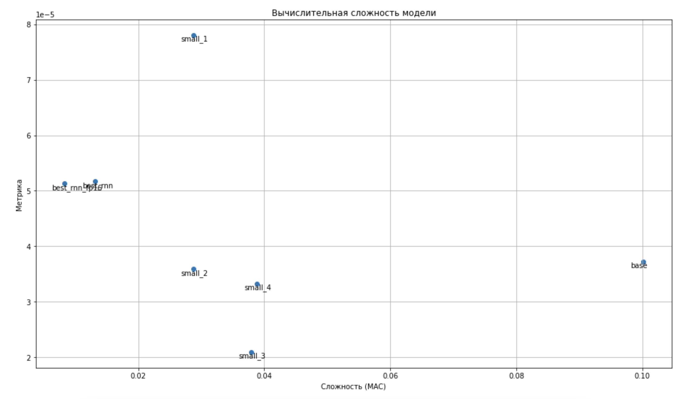
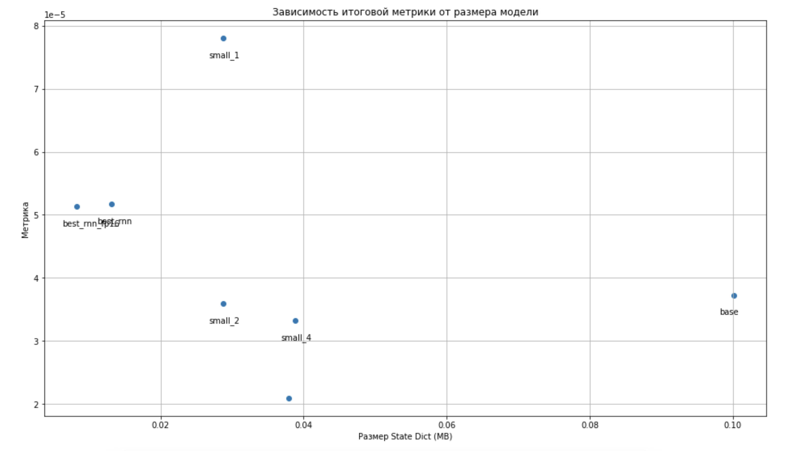

# KWS Homework

## Streaming

Я реализовал модель для потоковых данных на основе базовой модели с семинара. Реализация и сохранение в виде `torch.jit` находятся в файле `streaming.ipynb`.

## Compression + speedup

Для того, чтобы сжать свою модель, я в основном использовал технику layer-wise дистилляции. Это значит, что я добавил функции потерь, которые отражали близость выхода каждого слоя учителя и ученика.
При этом возникала проблема, заключающаяся в том, что выходы учителя и ученика имели разные размерности. Чтобы их сравнивать, я спроецировал их в оно пространство обучаемыми линейными слоями. После этого я применял MSE в качестве функции потерь.

Сначала я получил базовую модель `base_model.pt` с качеством `~3e-5`. Это я сделал в файле `train_base_model.ipynb`. Стоит заметить, что при разделении датасета на трейн и тест я зафиксировал seed, чтобы в других экспериментах разделение было тем же самым и не произошло утечки таргета. Я также дополнительно проверял соответствия разделения, сверяя индексы разделения, которые получаличсь.

Мои главные эксперименты заключались в следующем:
1. Используя layer-wise дистилляцию с базовой моделью, подобрать параметры слоев CRNN и гиперпараметры обучения, так, чтобы модель стала меньше. В основном я подбирал `hidden_size`, количество каналов в свертке и шаги свертки. Я также попробовал сделать свертку сепарабельной, но из-за больших шагов это было неэффективно. Таким способом удалось достигнуть показателей Compression Rate: 2.578, Speedup Rate: 2.059 при необходимом качестве.
2. Заменить GRU в исходной модели на RNN и обучать, используя также layer-wise дистилляцию с базовой моделью. Это значительно улучшило скорость модели, так как RNN гораздо легче GRU. Таким образом удалось достичь результата Compression Rate: 7.623, Speedup Rate: 8.507, что было уже неплохо.
3. Использовать `float16` вместо `float32`. Это почти не изменило качество моей лучшей модели, но позволило почти в два раза уменьшить размер в мегабайтах. Таким образом, качество стало `5.132090919764682e-05`, что меньше требуемых `~5e-5 * 1.1`, а сжатие и скорость улучшились до CR: 12.045, SR: 8.507, Score: 6.477/7.000.

Все эксперименты содержатся в файле `experiments.ipynb`. Все веса моделей также лежат в репозитории. Воспроизвести эксперименты можно перезапустив ноутбук `experiments.ipynb`. Получить базовую модель можно запустив ноутбук `train_base_model.ipynb`

## Визуализация результатов

